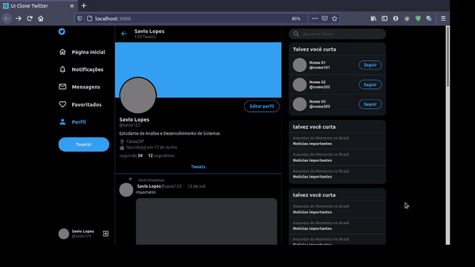

  

 

## :rocket: Tecnologias

Esse projeto foi desenvolvido com as seguintes tecnologias:

- [React](https://reactjs.org)
- [Typescript](https://www.typescriptlang.org/)

 

## 💻 Projeto

Este projeto é UI Clone responsivo do Twitter.

Para acessar o deploy do projeto, utilize o link abaixo:

https://optimistic-lumiere-cf6d1f.netlify.app
